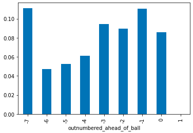
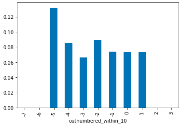
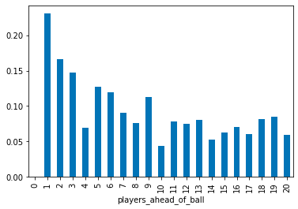
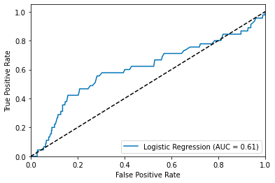

<html>
    <body>
        <h1>Predicting Passes That Become Goals</h1>
        
The data used for this project is MLS locations data and event data. The data was merged together, creating a dataset 
        with all passes, along with the position on the field of each player when the pass was made. Features were 
        then added to the data to help further descibe the play, things such as how many players were ahead of the ball and how
        many teammates or opponents were within a certain proximity of the ball. 

        <h1>Feature Selection</h1>
        
The data in this project was very random and imbalanced, which made the predictive analysis very hard. After evaluating 
        all of the data it became apparent that these 3 features were the best predictors: 

        
(What these graphs are showing us is the mean of each value in the feature. A goal is equal to 1, and no goal is equal to 0. For example on the graph above, when there are 3 more defenders ahead of the ball when a pass is made, the mean goals average goals scored on the play is around 0.09 goals.)

        <ul>
            <li>Outnumbered Ahead of Ball - this describes the difference between attackers and defenders ahead of the ball when the pass is made.
             If the number is negative there are more defenders than attackers. </li>
            
            
(What these graphs are showing us is the mean of each value in the feature. A goal is equal to 1, and no goal is equal to 0. For example on the graph above, when there are 3 more defenders ahead of the ball when a pass is made, the average amount goals scored on the play is around 0.09 goals.)

            <li>Outnumbered Within 10 Yards - This describes the difference in attackers and defenders within 10 yards of the ball when the pass is made.  </li>
            
            <li>Players Ahead of Ball - This describes the total number of players ahead of the ball when the pass is made. It does not take into account which team the players are on. </li>
            
        </ul>
        <h1>Predicitve Analysis</h1>
        
To make predictions on the data I tried multiple different classification models, and logistic regression worked the best. Like I said earlier, the randomness and imbalance of the data made it very hard to predict. 
            The data was shuffled and 80% of the data was used for training the model and 20% was used to test the model. 
            Using the logistic regression model, I calculated the probability of each pass in the test set of becoming a goal. To evaluate these predictions, I calculated the area underneath the ROC Curve (AUC), accuracy, and precision score. 
            The results are telling us that the model is able to predict correctly 82% of the time, however the recall score suggests that is is only predicting 36% of goals correctly.
        The AUC came out to be .61, and a perfectly random selection would score .5. This means that our model performed better than random, but still struggled with predicting goals accurately. 
        

        
Accuracy: 0.82
 
        
Precision: 0.18
 
        
    </body>
</html>
